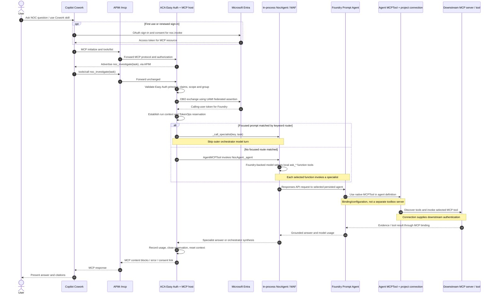
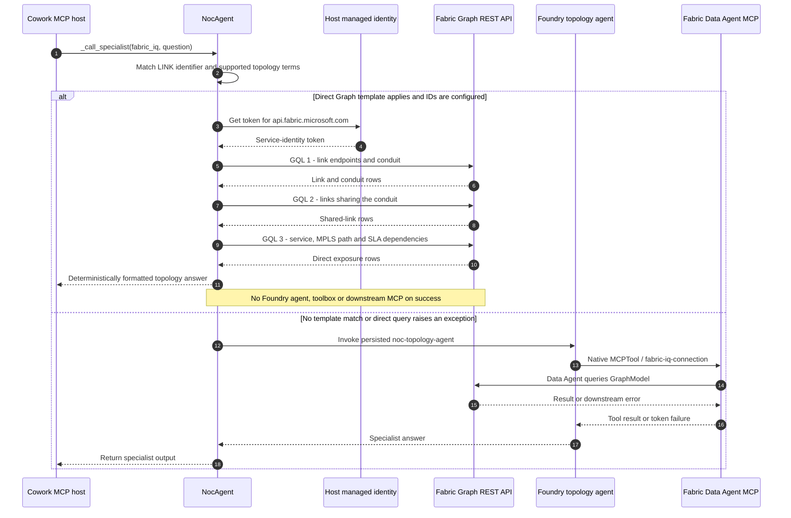

# Copilot Cowork MCP channel

This is the consolidated setup and operations guide. The
[component sequences](#7-component-level-sequences-and-the-two-approaches),
[authentication status](#8-authentication-status-and-remaining-challenges), and
[remaining work](#9-acceptance-status-and-remaining-work) are included below.

This channel exposes the existing in-process `NocAgent._agent` as one
read-only MCP tool, `noc_investigate`, without changing the Teams/A365
channel. The canonical public endpoint is APIM `/mcp`; APIM is a transparent
pass-through to an Azure Container App protected by Container Apps built-in
authentication (Easy Auth).

## Target configuration

These values are deployment inputs only. Nothing in this repository deploys
until an operator runs the commands.

| Setting | Value |
|---|---|
| Subscription | `<subscription-id>` |
| Tenant | `<tenant-id>` |
| Region | `<azure-region>` |
| Resource group | `<resource-group>` |
| MCP route | `https://<apim-name>.azure-api.net/mcp` |
| Protected-resource metadata | `https://<apim-name>.azure-api.net/.well-known/oauth-protected-resource/mcp` |
| MCP scope value | `noc.invoke` |

## Runtime and security contract

- `StreamableHTTPSessionManager(json_response=True, stateless=True)` serves
  `/mcp`. One `NocAgent` is initialized for the process lifespan.
- Every `tools/call` reads the Easy Auth-validated bearer token, defensively
  checks `tid`, `aud`, `oid`, `scp`, `exp`, `nbf`, and authorized group
  membership without reimplementing JWT signature validation, then resets all
  per-call context variables in a `finally` block. The MCP resource app must
  set `groupMembershipClaims: SecurityGroup`; otherwise Entra omits `groups`
  from the token and the application correctly returns `401`.
- Easy Auth uses `AllowAnonymous` only so the ASGI app can emit the exact RFC
  9728 challenge for missing credentials. A call is accepted only when Easy
  Auth injected `X-MS-CLIENT-PRINCIPAL` and its tenant/object claims match the
  bearer payload; an unvalidated bearer token is rejected.
- The run ID is derived from the caller `oid` and MCP JSON-RPC request ID.
  Run-token minting, precall/postcall decisions, specialist routing, and usage
  logging reuse `NocAgent` and the existing run ledger. Specialist usage stays
  exact; the MCP adapter closes the orchestrator reservation with a text-token
  estimate because `AgentMCPTool` returns MCP content blocks rather than the
  underlying `AgentResponse` usage object.
- Downstream user delegation uses `azure.identity.aio.OnBehalfOfCredential`.
  Its client assertion is a token minted for
  `api://AzureADTokenExchange` by the MCP user-assigned managed identity; the
  OBO target is `https://ai.azure.com/.default`. No client secret is stored.
- APIM performs no model, token, or body policy on `/mcp`. It preserves the
  MCP request/response, authorization, protocol headers, and
  `WWW-Authenticate` challenge.

## 1. Prerequisites

Install Azure CLI with Bicep, Python 3.11+, Docker or ACR Tasks, and the
Microsoft 365 Agents Toolkit CLI:

```powershell
npm install -g @microsoft/m365agentstoolkit-cli
az login --tenant <tenant-id>
az account set --subscription <subscription-id>
```

The operator needs rights to deploy the gateway stack and assign RBAC. The
Entra setup requires application administrator rights; tenant-wide delegated
admin consent requires an appropriately privileged administrator.

Capture these existing agent-stack values before deploying the MCP host:

```powershell
$foundryEndpoint = "<FOUNDRY_PROJECT_ENDPOINT>"
$foundryProjectResourceId = "<Foundry account/project ARM resource ID>"
$searchServiceResourceId = "<Azure AI Search ARM resource ID>"
$model = "<AZURE_AI_MODEL_DEPLOYMENT_NAME>"
```

## 2. Bootstrap the gateway identity

The Entra federated credential needs the MCP UAMI principal ID, while the full
MCP Container App needs the Entra resource-app ID. Use two idempotent Bicep
passes for a fresh environment:

1. Deploy `gateway/infra/main.bicep` with `mcpHostImage=''`. This recreates the
   complete gateway base, including APIM, the Container Apps environment,
   run ledger, ACR, and `id-mcphost-*`, but intentionally skips the MCP app and
   APIs.
2. Capture deployment outputs `mcpHostIdentityClientId`,
   `mcpHostIdentityPrincipalId`, `apimName`, and `acrLoginServer`.

Supply the existing required gateway parameters, including the secure
`runTokenSigningSecretValue`; do not put that value in a parameter file or
source control. Use `az deployment sub what-if` before the first create.

## 3. Create the Entra applications and trust

Run the idempotent setup script with the UAMI outputs:

```powershell
python scripts/setup_cowork_mcp_entra.py `
  --tenant-id <tenant-id> `
  --mcp-uami-client-id "<mcpHostIdentityClientId>" `
  --mcp-uami-principal-id "<mcpHostIdentityPrincipalId>"
```

The script creates or updates:

- the MCP server/resource application, `requestedAccessTokenVersion=2`, with
  exposed delegated scope `noc.invoke`;
- a separate Cowork OAuth client retained for direct delegated-flow diagnostics;
  the Teams Developer Portal auth configuration itself must use the MCP
  resource application's client ID;
- client-to-resource delegated permission and admin consent for that diagnostic
  client;
- the resource application's delegated Azure AI permission needed by the OBO
  exchange, plus Fabric `DataAgent.Read/Execute` and `GraphInstance.Read/Execute`
  permissions used by the topology path, with tenant-wide admin consent;
- a federated identity credential that trusts the MCP UAMI as the resource
  application's client assertion.

It emits both app IDs, the resource URI, full scope, deterministic Cowork
manifest GUID, and an explicit placeholder for the external
`OAuthPluginVault` auth configuration. Re-running it reuses exact app display
names or IDs and merges permissions; it never creates a client secret.

### Create the external auth configuration

The Microsoft Enterprise token-store record is a Microsoft 365 operation and
is not exposed by the available Microsoft Graph APIs, so the script cannot
create it. In the [Teams Developer Portal](https://dev.teams.microsoft.com/):

1. Open **Tools > Microsoft Entra SSO client ID registration** and select
   **New client registration**.
2. Set the base URL to the APIM MCP URL. Set **Client ID** to the emitted
   `mcpResourceAppClientId` (the app securing the MCP server), **not**
   `coworkOAuthClientAppId`. Set **Scope** to the emitted full
   `api://<resource-app-id>/noc.invoke` scope.
3. Restrict the registration to the target organization. If the final Teams
   app ID is not yet registered, select **Any Teams app** temporarily. After
   installation, bind it to the app manifest's stable `id` (`coworkManifestId`),
   not an Agent Identity, Entra object ID, OAuth client ID, or installation
   `TitleId`.
4. Save and copy both generated values:
   - **Microsoft Entra SSO registration ID** -> `COWORK_AUTH_CONFIG_REFERENCE_ID`.
   - **Application ID URI** -> the additional audience required below.

If the generated Application ID URI ends with `coworkOAuthClientAppId`, the
wrong client ID was registered. Delete or replace that auth configuration and
repeat step 2 with `mcpResourceAppClientId`.

The portal registration is not the final authentication step. Per the
[Microsoft Entra SSO guidance](https://learn.microsoft.com/microsoft-365/copilot/extensibility/plugin-authentication-entra-sso), rerun the setup script with the generated URI:

```powershell
python scripts/setup_cowork_mcp_entra.py `
  --tenant-id <tenant-id> `
  --mcp-uami-client-id "<mcpHostIdentityClientId>" `
  --mcp-uami-principal-id "<mcpHostIdentityPrincipalId>" `
  --resource-app-id "<mcpResourceAppClientId>" `
  --cowork-client-app-id "<coworkOAuthClientAppId>" `
  --sso-application-id-uri "<portal-generated-Application-ID-URI>"
```

This preserves the original `api://<resource-app-id>` identifier, adds the
portal-generated identifier URI, adds the Teams OAuth consent redirect URI,
and preauthorizes the Microsoft Enterprise token store client
`ab3be6b7-f5df-413d-ac2d-abf1e3fd9c0b` for `noc.invoke`. Finally, redeploy the
MCP host with `mcpServerAudience` set to the portal-generated Application ID
URI so both Easy Auth and the application accept the token audience. Easy
Auth must also list Microsoft Enterprise token store client
`ab3be6b7-f5df-413d-ac2d-abf1e3fd9c0b` in
`defaultAuthorizationPolicy.allowedApplications`; otherwise Cowork reaches
APIM but receives `403 Forbidden` before the request reaches the MCP process.
Keep `MCP_SCOPE_URI` on the original `api://<resource-app-id>/noc.invoke` value:
the requested scope and the resulting access-token audience are intentionally
different values in this flow.

## 4. Build and deploy the MCP host

Build the dedicated image from the `agent` context:

```powershell
az acr build `
  --registry "<acr-name>" `
  --image "noc-mcp:1.0.0" `
  --file agent/Dockerfile.mcp `
  agent
```

Run the second `gateway/infra/main.bicep` deployment with:

```text
mcpHostImage=<acr-login-server>/noc-mcp:1.0.0
mcpFoundryProjectEndpoint=<existing Foundry project endpoint>
mcpFoundryModelDeploymentName=<existing model deployment>
mcpFabricWorkspaceId=<Fabric workspace GUID>
mcpFabricGraphModelId=<Fabric GraphModel GUID>
mcpFoundryProjectResourceId=<existing Foundry project ARM resource ID>
mcpSearchServiceResourceId=<existing Search service ARM resource ID>
mcpCallerPrincipalId=<Entra group object ID containing authorized Cowork users>
mcpCallerPrincipalType=Group
mcpServerAppClientId=<script mcpResourceAppClientId>
mcpServerAudience=<portal-generated Application ID URI>
mcpRequiredScope=noc.invoke
mcpToolTimeoutSeconds=28
entraTenantId=<tenant-id>
```

This pass creates the externally-ingressed MCP Container App inside the
internal Container Apps environment, Easy Auth, managed-identity Foundry/Search
RBAC, all five project-scoped caller roles required by the OBO specialist path,
and both APIM routes. The same caller group also needs Fabric workspace Viewer
(or higher) for RTI/Fabric IQ data-plane access. Validate the metadata route:

```powershell
curl.exe "https://<apim-name>.azure-api.net/.well-known/oauth-protected-resource/mcp"
curl.exe -i -X POST "https://<apim-name>.azure-api.net/mcp"
```

The first call returns RFC 9728 metadata. The unauthenticated MCP call returns
`401` and a `WWW-Authenticate` header containing the same metadata URL.

For the direct Graph path, set `FABRIC_WORKSPACE_ID` and
`FABRIC_GRAPH_MODEL_ID` in the deployment environment. The gateway parameter
file maps these to `mcpFabricWorkspaceId`/`mcpFabricGraphModelId`; the Teams
parameter file maps them to `fabricWorkspaceId`/`fabricGraphModelId`. Both
hosts receive the matching environment variables through Bicep. Populate
these in each azd environment used for provisioning; a repo-root `.env` alone
is not a substitute for azd deployment inputs.

Fabric workspace grants are separate from ARM RBAC. Set
`MCP_HOST_PRINCIPAL_ID` to the MCP UAMI object ID and
`TEAMS_APP_SERVICE_PRINCIPAL_ID` to the Teams App Service system-identity
object ID in the repo-root `.env`, then run
`python scripts/grant_agent_identity_access.py` after its required Agent
Identity inputs are configured (see [Deployment section 4b](DEPLOYMENT.md#4b-grant-the-agent-identity-access-to-fabric-required-one-time-per-environment)).
The script grants the host identities workspace Contributor for direct Graph
execution. These are principal/object IDs, not application/client IDs.

## 5. Package and sideload Cowork

The committed icons are deterministic valid PNG files. Regenerate them only
when intentionally changing icon code:

```powershell
python cowork/generate_icons.py
```

Build the package with the values emitted above:

```powershell
python cowork/package.py `
  --mcp-url "https://<apim-name>.azure-api.net/mcp" `
  --auth-config-reference-id "<Microsoft-Entra-SSO-registration-ID>" `
  --manifest-id "<coworkManifestId>"
```

The output is `cowork/build/noc-cowork.zip`. The script resolves placeholders
in memory, validates the URL/GUID, and packages `manifest.json`, both icons,
the matching tool description, and every `SKILL.md` folder declared by the
manifest. The tool
description is written as `noc-mcp-tools.json` at the ZIP root (not under a
`tools/` directory), and must contain a non-empty top-level `tools` array.

For a personal sideload:

```powershell
npm install -g @microsoft/m365agentstoolkit-cli
atk auth login m365
atk install --file-path "C:/Flutter/noc-agent-a365/cowork/build/noc-cowork.zip" --scope Personal
```

For tenant testing, open **Microsoft 365 admin center > Manage apps > Upload
custom app**, upload the same ZIP, choose **Add agent**, and assign it to the
test users. Save the returned `TitleId` and `AppId` from either path.

## 6. Test in Cowork

1. Open Microsoft 365 Copilot **Cowork > Sources & Skills > Plugins**.
2. Find **NOC Investigation** in **Discover**, enable it, and complete the
   one-time Entra consent prompt.
3. Test Foundry IQ narrative: `What's our standard runbook for a fibre cut on
   a DWDM link, and has anything like INC-2025-08-14-0042 happened before?`
4. Test Fabric IQ topology: `If LINK-SYD-MEL-FIBRE-01 goes down completely,
   what's the blast radius, and is there any other link sharing the same
   physical conduit?`
5. Test Web IQ public evidence: `Is there any public vendor advisory or carrier
   status-page report about DWDM equipment issues on the Sydney–Melbourne
   corridor this week?`
6. Test Work IQ context: `Who's on-call right now, and what's being discussed
   on the current incident bridge?`
7. Test RTI live evidence: `For LINK-SYD-MEL-FIBRE-01, what was the alert
   timeline and optical readings around 2025-08-14 03:22 UTC — when exactly did
   loss of light hit each sensor, and was anything suppressed?`
8. Test evidence versus narrative: `For the SYD-MEL fibre cut, what does the
   ticket say the time-to-detect was, versus what the actual telemetry shows?`
9. Confirm the tool shown in each run is `noc_investigate`, results identify the
   requested specialist grounding, and no action is represented as executed.

**Cowork requires each tool call to complete in less than 30 seconds.** The
host enforces `MCP_TOOL_TIMEOUT_SECONDS` with a default and hard ceiling of
28 seconds. A full NOC investigation across all five specialists can exceed
that limit; use the focused specialist skill workflows or retry with a narrower
asset/evidence question. The timeout is enforced in the application, not
simulated by an APIM policy.

## 7. Component-level sequences and the two approaches

### Approach A: Foundry specialist with a native MCP tool



| Stage | Component | Responsibility |
|---|---|---|
| 1. Select | Cowork | A skill guides the task; Cowork calls `noc_investigate`, not the five specialists directly. |
| 2. Enter | APIM | Transparent Streamable HTTP MCP proxy, preserving authorization, protocol headers and challenges. No model/token policy runs on `/mcp`. |
| 3. Authorize | Easy Auth and MCP host | Easy Auth validates the token; the app checks the injected principal, tenant, audience, scope, identity and authorized group. |
| 4. Delegate | Entra and MCP UAMI | Federated assertion for `api://AzureADTokenExchange`, then OBO for `https://ai.azure.com/.default`. This currently happens before routing, even for direct Graph. |
| 5. Govern | Host and run ledger | Establish per-call context, mint a run token and request a precall decision when configured. Halt/queue decisions can stop execution. |
| 6. Route | NocAgent | Focused keyword matches bypass the outer model. Otherwise the in-process MAF orchestrator uses a Foundry model to select local `ask_*` function tools. |
| 7. Reason | Persisted Prompt Agent | Receives the question via Responses API and selects tools from its persisted definition. |
| 8. Retrieve | Native MCP binding and remote server | `MCPTool(project_connection_id=...)` supplies connection configuration; the remote MCP server executes its tool against the data source. Tool discovery may be reused rather than repeated per turn. |
| 9. Return | Foundry, host, APIM and Cowork | Evidence becomes a specialist answer, optionally orchestrator synthesis, MCP content and finally Cowork's presentation. Errors and consent requirements must remain explicit. |

**Where is the toolbox?** The old shared `noc-iq-toolbox` is no longer a
separate runtime hop. Each persisted specialist has its own native `MCPTool`
and project connection. "Toolbox" can describe this tool configuration
informally, but it is not an additional server between agent and tool.

**Routing limitation:** `_direct_specialist_for_task` currently chooses the
first matching keyword route. Combined questions that contain those keywords
may be routed to one specialist; multi-specialist orchestration is not
guaranteed for every combined prompt.

### Approach B: deterministic direct Fabric Graph

This path follows the same ingress, authorization, OBO and run-context steps:



| Aspect | Approach A: Foundry + MCP | Approach B: direct Graph |
|---|---|---|
| Scope | Specialist reasoning and flexible questions over its tool surface | Focused `LINK-*` blast-radius/conduit templates only |
| Execution | Prompt Agent -> native MCPTool/connection -> downstream MCP server | NocAgent -> Graph REST `executeQuery?preview=true` |
| Graph data identity | User-delegated connection for the topology specialist | MCP UAMI, or Teams App Service managed identity |
| Authorization boundary | Caller authorization plus downstream user permissions/consent | Caller authorization at the host plus host workspace access; not per-user Graph filtering |
| Model involvement | Specialist model, optionally an outer orchestrator model | No specialist model on success; Cowork still presents the result |
| Current topology status | Nested Data Agent-to-Graph token error remains unresolved | Focused topology accepted in both Teams and Cowork |
| Tradeoff | More flexible but adds latency and nested auth dependencies | Faster and deterministic, but limited query coverage and broader service-identity access |

The Graph HTTP read timeout is 20 seconds; the outer Cowork call has a
28-second maximum including OBO. On direct-query exceptions, the current code
attempts the persisted specialist with the remaining outer budget. This can
obscure a transport timeout behind a later Data Agent token error. A successful
direct query bypasses the nested-token problem; it does not fix it.

### Specialist-to-tool mapping

| Cowork intent | Persisted Foundry agent | Native MCP connection | Tool/data surface |
|---|---|---|---|
| `foundry_iq`: runbooks and prior tickets | `noc-knowledge-agent` | `kb-mcp-connection` | Foundry IQ knowledge-base MCP / Azure AI Search-backed knowledge |
| `fabric_iq`: general topology | `noc-topology-agent` | `fabric-iq-connection` | Fabric Data Agent MCP / GraphModel |
| `web_iq`: public advisories | `noc-threatintel-agent` | `web-iq-connection` | Public web-search MCP |
| `work_iq`: on-call and incident bridge | `noc-comms-agent` | `WorkIQ` | Microsoft 365 MCP / Teams and Outlook context |
| `rti_iq`: incident evidence | `noc-incident-agent` | `FABRIC_RTI_CONNECTION_ID` | Fabric Eventhouse KQL MCP / telemetry and alerts |
| Focused link blast radius / conduit | Bypassed on direct success | Bypassed | Three deterministic Graph REST GQL queries |

Calls to Foundry use the calling-user token for Fabric/Work/RTI specialists
and the service credential for Foundry IQ/Web IQ. Authentication to Foundry
and authentication from Foundry to the downstream tool are separate checks.

### Governance and answer boundaries

- Run-ledger calls are a side path from the host, not a hop between a Foundry
  agent and its tool. Specialists report SDK usage; the outer MCP reservation
  uses text-token estimates because MCP content blocks do not carry the
  underlying `AgentResponse` usage object.
- Direct Graph success has no specialist LLM usage. The outer MCP accounting
  still estimates text tokens; that estimate is not evidence of a specialist
  model invocation or its actual cost.
- The templates cover endpoints, conduit-sharing and direct service/SLA
  dependencies. They do not enumerate all diverse paths or indirect
  dependencies, prove failover behavior, or establish incurred penalties.
- Cowork may rephrase the result. Claims of "no remaining Sydney-Melbourne
  path", specific equipment/fibre-pair protection, or a failed wider-dependency
  query need separate evidence. Listed SLA exposure is potential exposure,
  not a confirmed bill.

Implementation: [`mcp_server.py`](../agent/mcp_server.py) (`call_tool`,
`_invoke_noc_tool`, `_direct_specialist_for_task`),
[`agent.py`](../agent/agent.py) (`_call_specialist`, `_call_topology_graph`,
`_build_orchestrator_tools`), and
[`create_foundry_agents.py`](../scripts/create_foundry_agents.py).

## 8. Authentication status and remaining challenges

Status as of 2026-09-08; success at one boundary does not prove every downstream
boundary works.

| Boundary / issue | Status and evidence | Operational guidance |
|---|---|---|
| Cowork -> APIM -> Easy Auth -> MCP | Working in fresh user turns. Earlier resource/client-ID confusion, scope/audience mismatch, token-store allowlisting, group-claim and packaging problems were corrected. | Keep the resource app ID in the portal registration, original `noc.invoke` scope, generated audience, token-store preauthorization/allowlist and group claims as documented in section 3. |
| MCP UAMI federation and Foundry OBO | Tokens acquired successfully in runtime logs; no stored client secret. | Preserve the federated trust and Azure AI delegated consent. Direct Graph still passes through this OBO preflight. |
| Foundry -> Fabric Data Agent -> GraphModel | Still failing with an internally invalid graph token when invoked through the topology specialist. Direct GQL works; the user reports Data Agent success inside Fabric. This isolates the failing nested connector path, but the provider's internal root cause is not confirmed. | Retain the direct template path for supported questions. Capture failed connector request/correlation IDs for Fabric/Foundry support rather than repeatedly broadening permissions or rebuilding the graph. |
| Fabric delegated permissions | `DataAgent.Read.All`, `DataAgent.Execute.All`, `GraphInstance.Read.All`, `GraphInstance.Execute.All` were granted to the Agent Identity and Cowork resource app. This did not resolve the nested failure. | Consent is not workspace RBAC and is not evidence of successful nested token exchange. |
| Direct Graph managed identities | Teams system identity and MCP UAMI have workspace Contributor; both returned the expected topology. | Keep workspace/GraphModel IDs in deployment inputs and host grants in the setup script. This is service access, not the caller's delegated Graph access; review least privilege and allowed caller scope before wider rollout. |
| RTI and Work IQ user delegation | Separate caller consent and resource-access requirements remain. RTI previously failed with 403 before permission fixes; later Teams turns returned live telemetry. | First-use consent can still be required. Foundry project access alone does not confer Eventhouse workspace or personal Microsoft 365 access. Do not label every specialist verified based on topology success. |
| Cowork Graph timeout followed by access error | At 09:30 UTC, direct Graph timed out, then fallback hit the nested-token error. A container probe reproduced `ReadTimeout`; later identical routed calls completed in 2.56 and 2.11 seconds without auth/network changes. | The original failure was a timeout, not proof of revoked access. Cause of the intermittent timeout is unconfirmed; a cold-start explanation is not established. |
| Web IQ 429 | A public-search/Foundry rate-limit response was observed; this is not an authentication failure. | Retry after cooldown and inspect quota/retry behavior if persistent. Disclose any reused results and their age. |

For incident chronology, graph ingestion/relationship findings and diagnostic
commands, see [Troubleshooting](TROUBLESHOOTING.md). The graph now includes
`Service -[:DEPENDS_ON]-> MPLSPath`; rebuilding its canvas is not a remedy for
the nested-token error.

## 9. Acceptance status and remaining work

Fresh Teams and Cowork responses supplied by the user on 2026-09-08 agree on:

| Evidence | Accepted result |
|---|---|
| Link endpoints | `LINK-SYD-MEL-FIBRE-01`: `CORE-SYD-01` -> `CORE-MEL-01` |
| Shared conduit | `CONDUIT-SYD-MEL-INLAND`, also carrying `LINK-SYD-MEL-FIBRE-02` |
| ACME exposure | `VPN-ACME-CORP`, 450 active users, GOLD `SLA-ACME-GOLD`, $50,000/hour |
| BigBank exposure | `VPN-BIGBANK`, 1,200 active users, SILVER `SLA-BIGBANK-SILVER`, $25,000/hour |
| Direct path | Both services use `MPLS-PATH-SYD-MEL-PRIMARY` |
| Aggregate | 1,650 listed users and $75,000/hour potential SLA exposure; no proof all alternate routes are absent |

Focused topology acceptance is complete on both channels. Remaining work is
explicitly not closed by the branch merge:

1. Resolve or escalate the nested Foundry/Data Agent Graph-token failure so
   non-template topology questions can use Approach A reliably.
2. Diagnose intermittent direct Graph read timeouts and improve failure
   attribution without concealing them behind fallback auth errors.
3. Confirm final end-to-end TokenOps usage/cost accounting, including the
   distinction between direct Graph, real specialist usage and outer MCP
   estimates. The missing `prompt_hash` / null-reservation 422 fixes are
   implemented, but they are not the full accounting acceptance.
4. Improve and exercise combined-intent routing and execution within the
   Cowork budget; the current first-match router is not a complete
   multi-domain classifier.
5. Complete fresh Work IQ/RTI consent and evidence checks and a Web IQ run
   after cooldown; retain source-specific failures and freshness labels.
6. Keep Cowork summaries within returned evidence. Broader indirect
   dependency and diverse-route coverage requires additional queries, not
   stronger wording over the existing templates.
