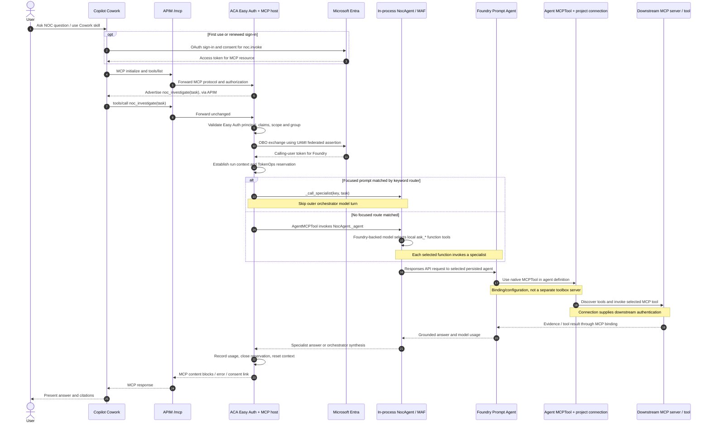
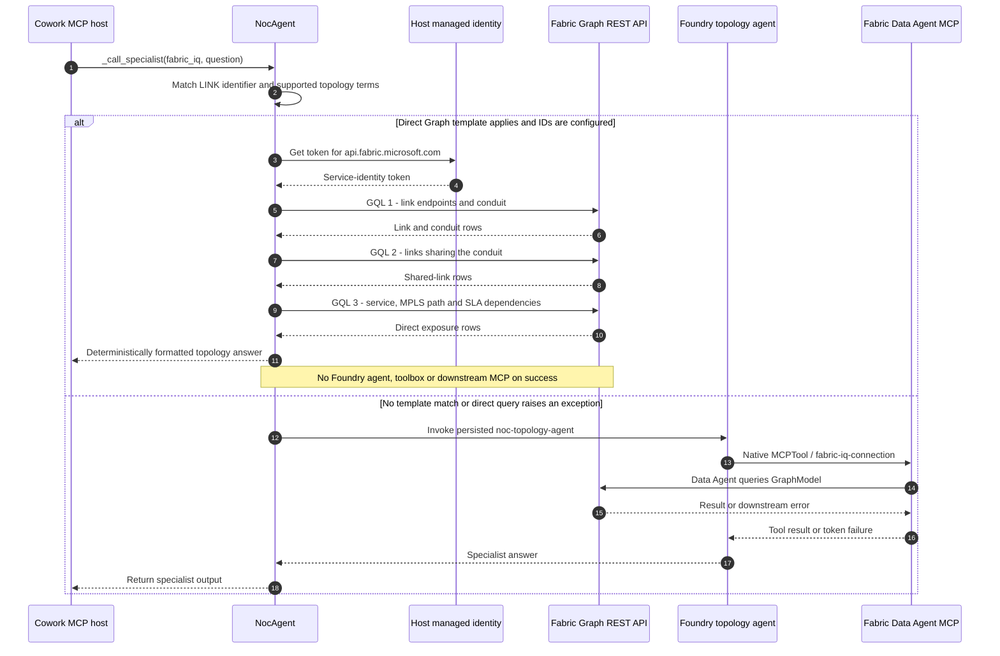

# Cowork component-level request sequence

This describes the implementation on `feat/cowork-mcp-channel` as of
2026-09-08. It separates the usual Foundry specialist path from the direct
Fabric Graph path used by focused link blast-radius/conduit requests.

## 1. Cowork to Foundry specialist to downstream tool

### Steps and responsibilities

| Stage | Component | What happens |
|---|---|---|
| 1. Select | Cowork | The skill guides the task and Cowork calls the single exposed tool, `noc_investigate`. Cowork does not directly call the five Foundry specialists. |
| 2. Enter | APIM `/mcp` | Transparent Streamable HTTP MCP proxy. Preserves authorization, protocol headers, body and authentication challenges; no model/token policy runs on this route. |
| 3. Authorize | Container Apps Easy Auth and `mcp_server.py` | Easy Auth validates the token; the app requires the injected principal and checks tenant, audience, scope, identity and allowed group. |
| 4. Delegate | Entra and MCP UAMI | The UAMI obtains a federated assertion for `api://AzureADTokenExchange`; OBO obtains a user token for `https://ai.azure.com/.default`. This currently happens before routing, including direct-Graph calls. |
| 5. Govern | MCP host and run ledger | Establish per-call context, mint the run token and request a precall decision when the ledger is configured. Halt/queue decisions can stop execution. |
| 6. Route | `NocAgent` | Recognized focused prompts skip the outer model. Otherwise, the in-process MAF orchestrator uses its Foundry model to choose local `ask_*` function tools. |
| 7. Reason | Persisted Foundry Prompt Agent | Receives the question through its Responses API and uses the MCP tool configured in its definition. |
| 8. Retrieve | Native MCP binding and remote server | `MCPTool(project_connection_id=...)` supplies the endpoint and connection authentication. The remote MCP server executes its selected tool against its data source. Tool discovery can be reused by the service, not necessarily repeated per turn. |
| 9. Return | Foundry, MCP host, APIM, Cowork | Evidence becomes a specialist answer, optionally an orchestrator synthesis, then MCP content and finally Cowork's presentation. Consent requirements or failures must remain explicit. |

**Where is the toolbox?** The old shared `noc-iq-toolbox` is not in this
runtime chain. Each persisted specialist has its own native `MCPTool` and
project connection. If using "toolbox" informally, it means this configured
tool binding, not an additional deployed service or network hop.

**Routing limitation:** the current focused router selects the first matching
keyword route. It does not guarantee that every combined question reaches
multi-specialist orchestration. The diagram shows actual routing behavior,
not an idealized intent classifier.

## 2. Focused Fabric topology fast path

After the common ingress, authorization, OBO and run-context steps above:

The direct route uses the **MCP host UAMI**, not the caller's delegated
Graph identity. It therefore uses the host's configured Fabric workspace
access, behind the MCP caller authorization boundary. It only returns the
three template result sets; it does not prove that every alternate path or
indirect dependency has been explored.

The template HTTP read timeout is 20 seconds. The enclosing Cowork invocation
has a maximum 28-second timeout covering OBO and execution. If a direct Graph
query raises, the current implementation attempts the persisted specialist
with whatever outer time budget remains. This can turn a direct-query timeout
into a final nested Data Agent token error. That nested connector failure
remains unresolved; direct Graph success bypasses it.

## 3. Specialist-to-tool mapping

| Cowork intent | Persisted Foundry agent | Native MCP connection | Tool/data surface |
|---|---|---|---|
| `foundry_iq`: runbooks and past tickets | `noc-knowledge-agent` | `kb-mcp-connection` | Foundry IQ knowledge-base MCP / Azure AI Search-backed knowledge |
| `fabric_iq`: general topology | `noc-topology-agent` | `fabric-iq-connection` | Fabric Data Agent MCP / GraphModel; nested-token issue remains |
| `web_iq`: public advisories | `noc-threatintel-agent` | `web-iq-connection` | Public web-search MCP |
| `work_iq`: on-call and bridge context | `noc-comms-agent` | `WorkIQ` | Microsoft 365 MCP / Teams and Outlook context |
| `rti_iq`: incident evidence | `noc-incident-agent` | `FABRIC_RTI_CONNECTION_ID` | Fabric Eventhouse KQL MCP / telemetry and alerts |
| Focused link blast radius / conduit | **Bypassed** on direct success | **Bypassed** | Three deterministic Fabric Graph REST GQL queries |

For calls to Foundry, Fabric/Work/RTI specialists use the calling-user token;
Foundry IQ and Web IQ use the service credential. Downstream connection
authentication is separate from authentication to the Foundry agent itself.
First-use consent is possible on user-delegated connections.

## 4. Governance and evidence boundaries

- Run-ledger calls are a side path from the host, not a hop between the
  Foundry agent and its MCP tool. Model specialists report SDK usage; the
  outer MCP reservation currently uses text-token estimates.
- A successful direct Graph call has no specialist LLM usage. The current
  outer MCP accounting still estimates text tokens, so do not interpret
  that estimate as proof of a specialist model invocation.
- Cowork can rephrase the MCP result. Its final wording is not a raw Graph
  result: absence of a diverse path, guaranteed outage, and incurred SLA
  penalties require evidence beyond the three topology templates.

Implementation references: [`mcp_server.py`](../agent/mcp_server.py)
(`call_tool`, `_invoke_noc_tool`, `_direct_specialist_for_task`),
[`agent.py`](../agent/agent.py) (`_call_specialist`,
`_call_topology_graph`, `_build_orchestrator_tools`), and
[`create_foundry_agents.py`](../scripts/create_foundry_agents.py)
(`MCPTool` provisioning).
