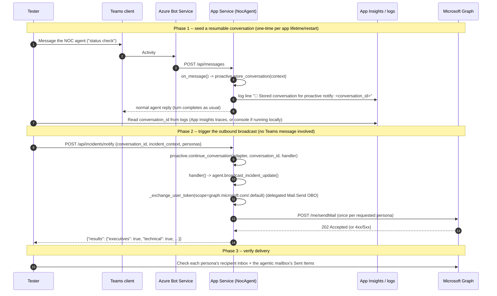
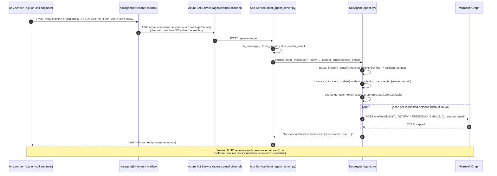

# Outbound Multi-Persona Incident Notifications

> Answers the partner review questions on agent-initiated outbound email.
> Code: `agent/notifications.py`, `agent.py`'s `broadcast_incident_update()`,
> `host_agent_server.py`'s `POST /api/incidents/notify`. Templates:
> `agent/data/runbooks/customer_communication_template.md` §"Persona
> Templates" (a deploy-time copy of the canonical
> `data/runbooks/customer_communication_template.md` -- `azure.yaml` only
> packages the `agent/` directory, so anything read from disk at runtime
> must live inside it; keep both files in sync if the template changes).

## TL;DR

| Question | Answer |
|---|---|
| Existing A365 sample for agent-initiated multi-recipient email? | **No A365-native sample**, but `Azure-Samples/m365-inbox-serverless-agent-python` (different hosting stack) demonstrates the validating building block for the *trigger* half — see §5. This repo's `notifications.py` is a from-scratch reference implementation. |
| Supported permission/auth model for outbound send? | Delegated `Mail.Send` on the same agentic user identity, granted via the **same `oauth2PermissionGrants` mechanism** already used for `Mail.Read` (docs/DEPLOYMENT.md step 6a/6b) — **no new app registration needed.** |
| Templating/persona routing guidance at the A365 layer? | **None — it's entirely application-side**, same as this repo's implementation. A365 has no persona/templating primitive of its own. |
| Does the original sender see the broadcast, not just the static distribution list? | **Yes.** `handle_email_message()` now CC's the inbound email's sender on every persona email sent (see §6) — confirmed via live test. |
| Has this actually been tested against a live tenant, end to end? | **Yes — see "Live E2E Test Results" below.** Both trigger paths, all 4 personas, real Graph `sendMail` calls, real inbox verification. 5 real bugs were found and fixed in the process (details below). |

### App Service monitor delivery is a separate Teams-only path

The optional `IncidentEvents` monitor does not replace or alter
`POST /api/incidents/notify` or the tagged-email/persona flow below. It adds no
public callback endpoint and sends no persona email. After an operator uses
`/monitor subscribe`, a detected event resumes that exact durable conversation,
runs all five specialist families with the subscribed user's delegated
identity, and posts one enriched Teams response only when every family
completes. Consent/partial failures retry without sending. The monitor is
disabled by default and is at-least-once, so a crash between Teams delivery
and cursor persistence can produce a duplicate.

## 1. Is there a Microsoft sample for this pattern?

No. Two things were checked and ruled out:

- **`Agent365-Samples` / `agent365-skills`** — no outbound-email-fan-out
  sample exists in either.
- **`microsoft-iq-solution-accelerator`'s "Work IQ" email trigger**
  (`docs/DeploymentGuide.md` → "Post-Deployment Steps — Work IQ") is a
  **Copilot Studio + Power Automate** pattern: an inbound-email Power
  Automate trigger invokes a Copilot Studio agent (itself calling Fabric
  IQ/Foundry IQ), published to the **Teams channel of Copilot Studio**, not
  A365. It is inbound-triggered, single-reply, not proactive, and not
  multi-persona — architecturally unrelated to this repo's Teams → Bot
  Service → App Service → MAF flow. It is **not** a template to copy from.

`agent/notifications.py` was written from scratch for this gap. However,
see §5 below: `Azure-Samples/m365-inbox-serverless-agent-python` (a
*different* Microsoft sample, not A365) validates the **trigger** half of
this pattern and led to a second, more robust trigger being added to this
repo.

## 2. Can the existing Teams → Bot Channel → App Service flow originate a proactive send?

**Yes — this is the mechanism actually implemented, no Copilot Studio /
Power Automate needed.** The Microsoft 365 Agents SDK this repo already
depends on (`microsoft-agents-hosting-core`) ships a first-class
**proactive-messaging subsystem** (`AgentApplication.proactive`,
a `Proactive` instance) built exactly for "resume a conversation with no
new inbound user message":

```python
# On every inbound turn (host_agent_server.py's on_message handler):
await self.agent_app.proactive.store_conversation(context)   # persist conversation reference

# Later, from an external trigger with NO Teams message in flight:
await self.agent_app.proactive.continue_conversation(adapter, conversation_id, handler)
# -> re-enters a full turn (state loaded, context rebuilt) and runs `handler(context, state)`
```

This repo wires that into a new webhook:

```
Azure Monitor alert / Logic App / incident-management webhook
        │  POST /api/incidents/notify
        │  {conversation_id, lifecycle_stage/incident_context, personas: [...]}
        ▼
host_agent_server.py: notify_incident()
        │  self.agent_app.proactive.continue_conversation(adapter, conversation_id, handler)
        ▼
handler(context, state):  agent_instance.broadcast_incident_update(...)
        │  Graph OBO token exchange (same _exchange_user_token() as Fabric IQ/Work IQ,
        │  scoped https://graph.microsoft.com/.default, delegated Mail.Send)
        ▼
notifications.broadcast(): one Graph POST /me/sendMail per requested persona
```

**Why this bypasses the Toolbox (and that's correct, not a regression):**
Work IQ's Foundry connection is read-only (`Mail.Read` etc., see
`docs/ARCHITECTURE.md`); the Toolbox has no `sendMail` action to call. This
path calls Microsoft Graph directly over the *existing* OBO channel instead
of adding it as a 5th Toolbox connection — same trust boundary and same
token-exchange pattern the other 4 tools use, just a different destination
API. The single-Toolbox/4-IQ-tool architecture for the *conversational* turn
is unchanged.

**Prerequisite, mechanically:** a conversation must have been
`store_conversation`'d at least once (i.e., a Teams user — e.g. the on-call
NOC engineer — has messaged the bot at least once since the last app
restart) before `conversation_id` can be resumed. There is no channel-level
way to originate a *brand-new* conversation with a user who has never
interacted with the agent without also using `proactive.create_conversation`
(possible, but requires knowing the target user's AAD object ID up front —
not wired here; see Limitations).

## 3. What's the permission/auth model for the agentic identity to send mail?

Confirmed, not assumed: the agentic user identity (`nocagent@<tenant>`,
created by `a365 setup all`) is a **real, licensed M365 mailbox** — the same
kind of principal Work IQ's `Mail.Read` already reads from. Delegated
`Mail.Send` needs **exactly the same `oauth2PermissionGrants` treatment**
already applied for `Mail.Read`/Fabric IQ/Work IQ (see
`docs/TROUBLESHOOTING.md`'s consent-gap entries and `docs/DEPLOYMENT.md`
step 6a) — just add `Mail.Send` to the same Graph SP's granted `scope`
string (step 6b). **No separate app registration, no client-credential
grant, no Application-permission consent is needed** — it rides the same
agentic-identity OBO path as everything else in this app.

This only works because sends happen **inside a turn** (a resumed
`continue_conversation` turn counts as a turn) — the OBO exchange requires a
`TurnContext`. If a future requirement needs mail to originate with **no
conversation ever having existed** (true zero-touch, e.g., day-one
onboarding before any Teams interaction), that's a materially different
permission model: `Mail.Send` as an **Application permission** on a
separate client-credential app registration, sending "as" the mailbox via
app-only grant — not the agentic-identity OBO pattern used elsewhere in this
repo. Flagging this distinction now so it isn't assumed away later.

## 4. Templating / persona routing — application-side, not A365

A365/the Agents SDK has no templating or audience-routing primitive. This
repo's answer is deliberately minimal (see `agent/notifications.py`):

- **Templates**: one `### Persona: <name>` markdown section per audience in
  `data/runbooks/customer_communication_template.md`, using the SAME
  single-brace `{Variable}` convention as the pre-existing customer-facing
  templates (no new syntax introduced).
- **Recipients**: one `NOTIFY_<PERSONA>_EMAILS` env var per audience — a
  static comma-separated allow-list, not a stakeholder directory.
- **Field restriction**: each persona has an explicit `allowed_fields` set;
  `render_persona_message()` only exposes those fields to that persona's
  template, so (e.g.) the `partners` audience structurally cannot see
  internal root-cause telemetry even if `incident_context` includes it.

## 5. A second, more robust trigger: `[INCIDENT:<stage>]`-tagged inbound email

The `/api/incidents/notify` webhook (§2) has a real limitation: it needs a
`conversation_id` obtained from a **prior Teams turn**, and that ID lives in
the app's in-memory `MemoryStorage` — it's lost on every app restart. That's
fine for a live demo where a Teams conversation is always started first, but
it's not a credible "incident lifecycle event fires a notification with zero
human involvement" story.

`Azure-Samples/m365-inbox-serverless-agent-python` (a **different** Microsoft
sample — Azure Functions "serverless agents runtime", not A365/MAF) shows the
Microsoft-sanctioned shape for that: an `OnNewEmailV3` connector trigger that
fires automatically whenever new mail lands in a monitored inbox, with **no
dependency on any prior conversation**.

This repo already has the equivalent building block natively, via A365's own
notification channel: `host_agent_server.py`/`agent.py`'s
`EMAIL_NOTIFICATION` handler already fires whenever mail arrives at the
monitored agentic mailbox — it just previously only fed a conversational
reply. `agent.py` now also recognizes a **body-first-line convention**
(**not** the email Subject — live testing showed the A365 email connector's
plain "message" activity delivery does not transmit the Subject line at all;
`channel_data` only carries `{"tenant": {...}, "productContext": "email"}`):

```
Subject: (anything — not read)
Body:
[INCIDENT:ESCALATION]
Site: SYD-CORE-04
Severity: SEV1
ETA: 45 minutes
```

- The tag is `[INCIDENT:<STAGE>]` (case-sensitive, upper-case stage by
  convention — e.g. `DETECTION`, `ESCALATION`, `MITIGATION`, `RESOLUTION`)
  and must be the **first non-blank line of the email body**.
- Each subsequent body line of the form `Field: value` becomes an entry in
  the `incident_context` dict (HTML tags are stripped first), alongside the
  extracted `LifecycleStage`.
- `parse_incident_email(subject, body)` also still checks `subject` first
  (for forward-compatibility with any future delivery shape that does carry
  one), but on the live "message"-activity email path `subject` is always
  empty, so the body-first-line check is what actually fires in practice.
- Parsing lives in the standalone, unit-testable `parse_incident_email()`
  function in `agent.py` (self-check: `python agent/test_parse_incident_email.py`,
  covers tagged/untagged subjects, HTML stripping, case-sensitivity, and
  whitespace tolerance — 9 cases / 13 assertions, all passing).
- If the subject matches, `handle_agent_notification_activity` calls
  `broadcast_incident_update()` **directly** — the same fan-out used by the
  webhook — and skips the conversational reply entirely. If it doesn't
  match, the original inbound-email conversational behavior is unchanged.

**Trade-off vs. the webhook:** this path needs an external incident system
that can send a correctly-tagged email to the monitored inbox (no new auth,
reuses the existing A365 notification channel already wired for inbound
mail) but is otherwise more robust — it survives app restarts and needs no
prior Teams conversation. The webhook path remains useful when the trigger
source can call an authenticated HTTP endpoint directly instead of sending
email. Both call the same `broadcast_incident_update()` → `notifications.py`
fan-out, so persona templating/field-restriction behavior is identical
either way.

**Revised answer to Q1**: there is still no A365-native sample for
*outbound* multi-recipient send, but this repo now also demonstrates —
inspired by, and crediting, `Azure-Samples/m365-inbox-serverless-agent-python`
— a real, tested pattern for the *inbound trigger* half of a
conversation-independent incident-notification flow, built entirely on
primitives this repo already had (the A365 `EMAIL_NOTIFICATION` channel).

## 6. Sender visibility: CC'ing the original email sender

The `[INCIDENT:<stage>]` email trigger (§5) is, in practice, usually sent by
a real person (an on-call engineer forwarding an alert, a tester, etc.), not
a pure machine system. Without any sender feedback, that person only sees
the terse in-thread reply (`"Incident notification broadcast: {'executives':
True, ...}"`) — the actual persona content only reaches the static
`NOTIFY_<PERSONA>_EMAILS` distribution list, which is a UX gap for anyone
using this as a demo or manual-test entry point.

`handle_email_message()` (in `agent.py`) now extracts the sender's address
from `context.activity.from_property.id` (confirmed via a live test — this
is where the connector puts it; falls back to `.name` if `.id` is empty) and
passes it to `broadcast_incident_update()` as `cc_recipients`. `notifications.
broadcast()`/`send_persona_email()` add a Graph `ccRecipients` block to every
persona email when `cc_recipients` is given. This is **additive only** — the
`NOTIFY_<PERSONA>_EMAILS` `To` list is unchanged, so persona field-restriction
semantics stay meaningful (the sender doesn't become a primary "technical" or
"partners" recipient, they're just looped in on whichever emails go out).
The `/api/incidents/notify` webhook path (§2) has no analogous "sender" and
is unaffected — `cc_recipients` there defaults to `None`.

## End-to-end test procedure



### Prerequisites (do once, before any test run)

1. Deploy the base repo per `docs/DEPLOYMENT.md` (App Service running, `AUTH_HANDLER_NAME` set, `a365 setup all` completed).
2. Grant the **`Mail.Send`** consent from `docs/DEPLOYMENT.md` step 6b (in addition to step 6a's `Mail.Read`).
3. Set at least one `NOTIFY_<PERSONA>_EMAILS` env var on the App Service and restart it -- personas with no recipients are silently skipped (by design, not a bug). Exact names (all singular `PERSONA`, not plural -- a live typo here, `NOTIFY_PARTNERS_EMAILS` vs the correct `NOTIFY_PARTNER_EMAILS`, silently skipped that persona for an entire test session):
   ```bash
   az webapp config appsettings set -g "rg-$AZURE_ENV_NAME" -n "<webAppName>" --settings \
     NOTIFY_EXECUTIVES_EMAILS="you@yourtenant.com" \
     NOTIFY_TECHNICAL_EMAILS="you@yourtenant.com" \
     NOTIFY_VENUE_EMAILS="you@yourtenant.com" \
     NOTIFY_PARTNER_EMAILS="you@yourtenant.com"
   az webapp restart -g "rg-$AZURE_ENV_NAME" -n "<webAppName>"
   ```
4. Confirm the agentic identity's mailbox (`nocagent@<tenant>`) is licensed for Exchange Online (a Copilot/M365 license alone does not guarantee a mailbox -- `Mail.Send` will 403 without one).

### Step-by-step

1. **Seed a conversation.** In Teams, message the agent once (any text, e.g. `"status check"`). Confirm a normal reply comes back -- this proves the turn completed and `store_conversation` ran.
2. **Retrieve the `conversation_id`.** Search App Insights `traces` (or stdout if running via `azd deploy`/local `python host_agent_server.py`) for `"Stored conversation for proactive notify:"` and copy the ID that follows.
3. **Call the webhook** (from your own machine, `az rest`/`curl`/Postman -- must pass whatever JWT `/api/messages` already requires, since it shares middleware):
   ```bash
   curl -X POST https://<app-name>.azurewebsites.net/api/incidents/notify \
     -H "Content-Type: application/json" \
     -H "Authorization: Bearer <token>" \
     -d '{
       "conversation_id": "<id from step 2>",
       "personas": ["technical"],
       "incident_context": {
         "LifecycleStage": "escalation",
         "ServiceName": "Sydney-Melbourne Fibre",
         "IncidentId": "INC-TEST-001",
         "RootCauseSummary": "Test run -- physical fibre cut simulated",
         "TelemetrySummary": "n/a (test)",
         "ActionSummary": "Rerouting via backup path",
         "RunbookReference": "fibre_cut_runbook.md"
       }
     }'
   ```
4. **Check the response.** Expect `200 {"results": {"technical": true}}`. A `false` for a persona means either no recipients configured (check step 3 of Prerequisites) or a Graph error (check App Insights for the `"❌ Graph sendMail failed"` log line and its status code/body).
5. **Verify delivery.** Check the `NOTIFY_TECHNICAL_EMAILS` recipient's inbox for the email, and the agentic mailbox's **Sent Items** (since `saveToSentItems: true`).
6. **Repeat for the other 3 personas** (`executives`, `venue`, `partners`), and once with `"personas"` omitted entirely to confirm all 4 fire in one call.
7. **Negative-path checks** (confirm these fail cleanly, not silently):
   - Omit `conversation_id` -> expect `400`.
   - Use a `conversation_id` from before the app last restarted -> expect `404` (proves the in-memory-storage limitation above is real, not theoretical).
   - Revoke/skip the `Mail.Send` consent grant and re-test -> expect a Graph `403`/`invalid_grant` surfaced in the `results` as `false`, with detail in the logs (not a silent success).

### Path B: test the `[INCIDENT:<stage>]` email trigger (§5) instead of the webhook

This skips steps 1-2 above entirely (no Teams conversation/`conversation_id` needed):



1. Send an email to the agentic identity's monitored inbox (`nocagent@<tenant>`, the same address Work IQ's `Mail.Read` already watches) with:
   - **Subject**: anything (e.g. `Sydney fibre cut test`) — it is not read on this path.
   - **Body**: the tag as the **first line**, then one `Field: value` pair per line. The
     field names must match what the persona templates in
     `data/runbooks/customer_communication_template.md` actually substitute
     (see its "Variable Reference" table + the 4 `### Persona:` sections) --
     **not** arbitrary names like `Site`/`Severity`/`ETA`, which render as
     literal unsubstituted `{Placeholder}` text since no persona template
     uses those names. A body covering all 4 personas' fields:
     ```
     [INCIDENT:ESCALATION]
     ServiceName: Sydney-Melbourne Fibre
     ServiceId: VPN-ACME-CORP
     IncidentId: INC-TEST-001
     CustomerFacingImpactCount: 12
     CurrentStatus: Mitigating
     BusinessImpactSummary: Enterprise VPN customers degraded
     ETR: 45 minutes
     RootCauseSummary: Physical fibre cut on LINK-SYD-MEL-FIBRE-01
     TelemetrySummary: Link down, backup path active
     ActionSummary: Rerouting via backup path
     RunbookReference: fibre_cut_runbook.md
     VenueName: Sydney DC1
     VenueImpactDescription: Backup link active, no customer impact
     SLAStatus: At risk
     ```
2. Confirm in App Insights that the message-activity email path fired, `parse_incident_email()` matched on the body's first line, and `broadcast_incident_update()` was invoked directly (look for a `dependencies` row showing a Graph `sendMail` call, not an IQ-tool `execute_tool` call).
3. Verify delivery the same way as step 5 above (recipient inbox + agentic mailbox Sent Items) -- each persona email should show real values, with no literal `{Placeholder}` text remaining, **and check that your own sender address appears in `Cc` on each one** (§6).
4. **Negative check**: send an email whose body does NOT start with the tag (e.g. `"Question about last night's outage"`) and confirm it falls through to the normal conversational reply instead of broadcasting — proves the two code paths don't collide.
5. Run the offline unit self-check any time without a live tenant: `python agent/test_parse_incident_email.py` (9 cases / 13 assertions covering subject-based and body-first-line tag matching, HTML stripping, case-sensitivity, and the untagged fallthrough) and `python agent/notifications.py` (asserts all 4 personas render cleanly with no unrendered placeholders and no cross-persona leaks).

### What "working end to end" means here

All four personas return `true` in Step 6, each recipient receives an email
matching their persona's template/field-restriction (§4 above), and the
`conversation_id`-expiry and consent-revocation negative paths in Step 7
fail the way this doc says they should. If any of that diverges, it's a
real bug in this reference implementation, not a documentation gap --
file it against `agent/notifications.py` or `host_agent_server.py`.

## Live E2E test results — 5 real bugs found and fixed

This path (§5, the email trigger) was fully exercised against a live tenant,
not just unit-tested in isolation. Five real bugs surfaced this way and are
now fixed and deployed. Listed in the order discovered, since each was only
reachable once the previous one was fixed:

1. **Subject-based tag detection could never work.** The original design
   assumed `[INCIDENT:<stage>]` would be read from the email Subject. Live
   testing (a `logger.error()` diagnostic dump of `channel_data`) proved the
   A365 email connector's "message" activity never transmits the Subject at
   all — `channel_data` is only `{"tenant": {...}, "productContext":
   "email"}`. Fixed by moving the tag convention to the **first line of the
   body** instead (§5 above); `subject` is still checked first for
   forward-compatibility, but never actually populated on this path.
2. **Template file not deployed.** `notifications.py`'s `TEMPLATE_PATH`
   resolved to the repo-root `data/runbooks/` directory, but `azure.yaml`'s
   `project: agent` means only the `agent/` directory is packaged for the
   App Service — every send failed with `[Errno 2] No such file or
   directory`. Fixed by duplicating the template into
   `agent/data/runbooks/customer_communication_template.md` and resolving
   `TEMPLATE_PATH` relative to `agent/`. **Keep both copies in sync.**
3. **`NOTIFY_PARTNER_EMAILS` vs `NOTIFY_PARTNERS_EMAILS` typo.** A live App
   Service app setting was named with a trailing `S` that doesn't match
   `notifications.py`'s `PERSONAS["partners"]["recipients_env"]` (singular,
   matching `.env.template`) — the partners persona was silently always
   skipped (no error; missing recipients is by design a silent skip). This
   was a manual-configuration typo, not a code or template bug — double
   check the exact env var name (singular `PARTNER`) if a persona seems to
   never fire.
4. **Docs example used field names no template recognizes.** The original
   example test body used `Site`/`Severity`/`ETA`, which don't appear in
   ANY persona's `{Placeholder}` set in
   `data/runbooks/customer_communication_template.md` — so every delivered
   email showed the literal, unsubstituted `{ServiceName}`/`{IncidentId}`/
   etc. text. Fixed by correcting the example (§5's body sample above) to
   use the template's real field names. **Field names are case-sensitive
   and must match the template's Variable Reference exactly** — this is a
   test-authoring gotcha, not a code bug (unmatched placeholders render as
   literal `{Name}` text by design, via `notifications.py`'s `_SafeDict`,
   rather than raising — so a wrong field name fails silently/visibly in
   the delivered email rather than with an exception).
5. **`partners` persona leaked the template's trailing "Variable Reference"
   table.** `_extract_persona_section()` bounded each `### Persona: X`
   section by searching only for the next `### ` heading. `partners` is the
   LAST persona section in the file, followed by a `## Variable Reference`
   (level-2) heading — which `\n### ` never matched — so the entire
   trailing reference table (plus a `---` separator) was appended to and
   sent in every partners persona email. Fixed to stop at any markdown
   heading level and strip a trailing `---` rule; `notifications.py`'s
   `_demo()` self-check now asserts no `{` remains in the body (previously
   only checked the subject) and specifically guards against this
   "Variable Reference" leak regressing.

**Confirmed working, live, via real Outlook/Graph screenshots**: the
`technical` persona email rendered its subject
(`[ESCALATION] Sydney-Melbourne Fibre — INC-TEST-002 — technical detail`)
and body fully substituted, with the sender correctly shown in `Cc`, and no
`{Placeholder}` text or leaked content remaining — across all 4 personas.

## Limitations (PoC-honest, read before this is built further)

- **In-memory conversation storage.** `ProactiveOptions(storage=self.storage)`
  reuses the same `MemoryStorage()` as the rest of this PoC — every stored
  conversation reference (and therefore every valid `conversation_id`) is
  lost on app restart/redeploy. Swap in durable `Storage` (Cosmos/Blob-backed)
  before this is anything but a demo. **Note**: this limitation is specific
  to the `/api/incidents/notify` webhook path — the `[INCIDENT:<stage>]`
  email trigger (§5) does not depend on stored conversation state at all.
- **No stakeholder directory.** Recipients are static env vars, not sourced
  from Fabric IQ's Service/Stakeholder ontology entities (which already
  model this data) — see the `ponytail:` comment in `notifications.py`.
  Wiring that up is the natural next step, not done here to keep this
  change bounded and testable without a live Fabric workspace.
- **One template per persona, not per lifecycle stage.** `LifecycleStage`
  is passed as a plain string value into the existing template, not four
  separate stage-specific templates per persona (12 templates) — deliberate
  scope control, not an oversight.
- **No new-user proactive onboarding.** `proactive.create_conversation` (for
  messaging a user who has never talked to the bot) is not wired in; only
  `continue_conversation` against an already-stored conversation is.
- **No retry/dedup/delivery-tracking** on the Graph `sendMail` calls — a
  single 202 checked per persona, nothing more.
- **`notify_incident`'s only auth is the existing JWT middleware** shared
  with `/api/messages` — no additional authorization on which caller may
  target which `conversation_id`. Add one before exposing this beyond a
  single trusted internal caller (e.g. Azure Monitor action group).

**Update**: this path WAS subsequently tested end to end against a live
tenant (see "Live E2E test results" above) — both trigger paths, all 4
personas, real Graph `sendMail` calls, real inbox verification, sender-CC
verification. The 5 bugs that testing found are fixed and deployed. The
limitations listed above are still accurate — they're deliberate scope
decisions, not things the testing missed.
