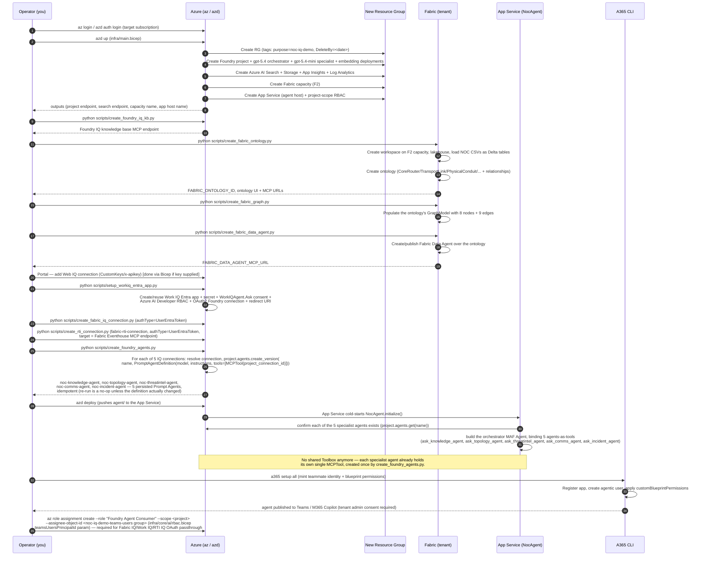
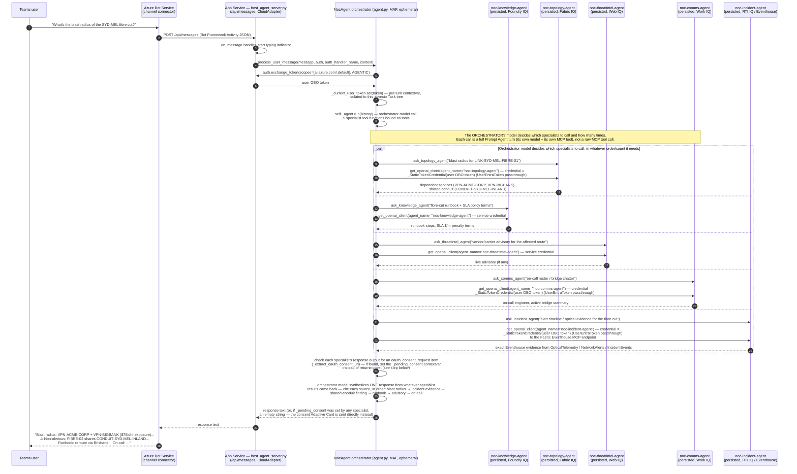
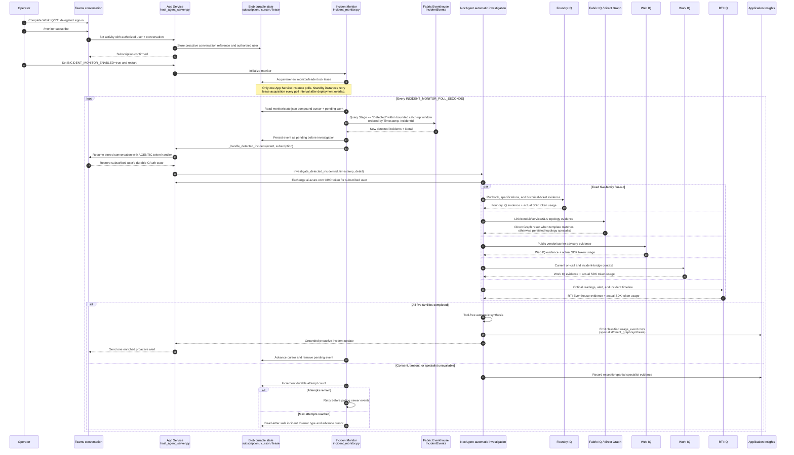
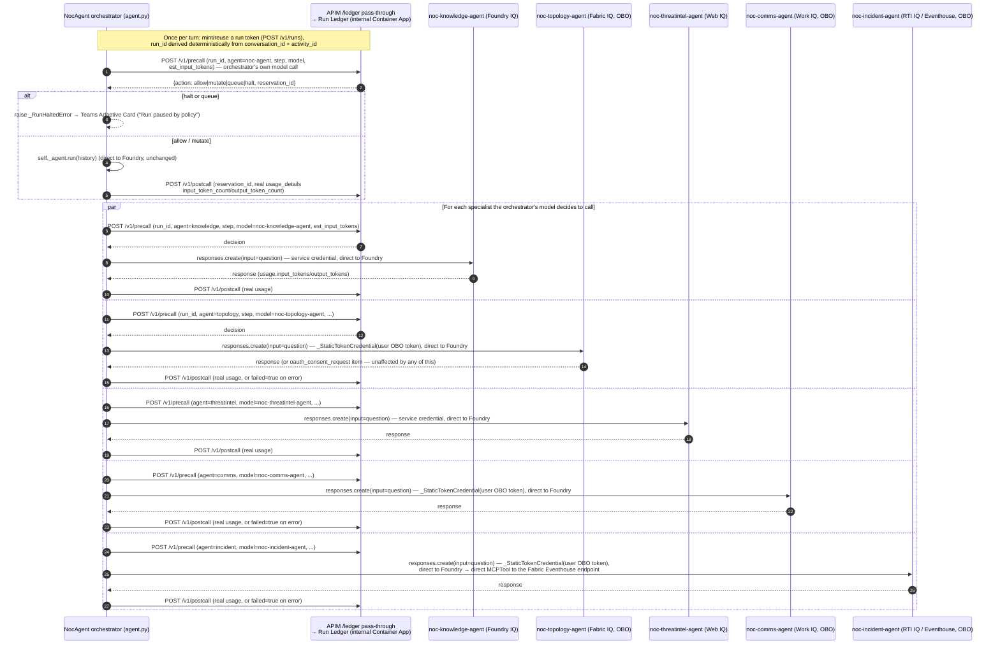
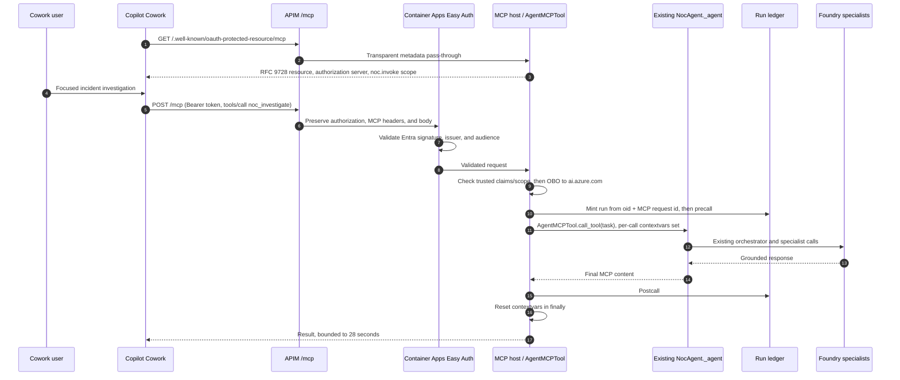

# Sequence Diagrams

## 1. End-to-end deployment sequence

## 2. Runtime turn — Teams user asks about the Sydney fibre cut

**Key point this diagram must make clear**: there are **five persisted Foundry
Prompt Agents**, each with its own single MCP tool baked into its own
definition, called via **agents-as-tools** from one ephemeral MAF
orchestrator `Agent`. The `par` block above shows the orchestrator model's
own tool-selection deciding which (and how many) specialists to invoke;
`agent.py` still does not iterate over the 5 IQ surfaces or hand-aggregate
their results itself — only the granularity of what's being routed to has
changed, from a raw MCP tool call to a whole persisted-agent turn.

RTI IQ is the deliberate "evidence" specialist in that set: live Eventhouse
facts from `OpticalTelemetry`, `NetworkAlerts`, and `IncidentEvents`. Foundry
IQ stays the "narrative" specialist: written tickets, runbooks, and
post-mortems. When both are called on the same incident, the orchestrator is
expected to reconcile them, not blur them together.

## 2A. Operations Agent — Eventhouse monitoring to proactive Teams alert

This is the unattended operations path. It does **not** require a user to ask
a question first, but it does require one-time setup in the destination Teams
conversation: complete delegated IQ consent and send `/monitor subscribe`.
The App Service owns detection, durable cursoring, investigation, retries, and
proactive delivery; Fabric Eventhouse remains the telemetry source.

Operational invariants:

- `IncidentEvents.Stage == "Detected"` is the trigger. The replay helper appends
  rows; it never clears or reseeds Eventhouse tables.
- The `(Timestamp, IncidentId)` cursor, pending item, subscription, and leader
  lease are durable Blob state. Delivery is at-least-once, so a process crash
  after Teams accepts a message but before cursor persistence can duplicate it.
- The automatic path has a **fixed five-family fan-out** and sends nothing when
  any required family is incomplete. This is intentionally stricter than an
  interactive turn where the orchestrator chooses a subset of tools.
- The resumed proactive turn passes the configured Agent 365 OAuth handler to
  restore the subscribed user's durable consent before OBO exchange.
- Direct Fabric Graph execution is classified as `accounting_mode=no_llm` with
  zero specialist tokens. Persisted specialists and final synthesis report
  actual SDK usage. Failed/retried model calls remain real billable rows.

## 3. Run-scoped token governance (TokenOps) — mixed routing, not a blanket APIM hop

**Why not simply route all 6 model calls (orchestrator + 5 specialists) through
APIM?** Two hard blockers, both discovered while wiring this up:

- **OAuth identity passthrough breaks.** `fabric_iq`, `work_iq`, and `rti_iq` authenticate
  each `responses.create()` call as the *calling Teams user* (a
  `_StaticTokenCredential` wrapping their OBO token), so Agent Service attributes
  the stored per-user consent grant correctly. APIM's `authentication-managed-identity`
  policy substitutes **its own** identity before the call reaches Foundry —
  fine for the 2 service-identity specialists, but it would silently break
  consent attribution for these 3.
- **Persisted-agent request bodies don't fit the gateway's assumptions.**
  `openai-gateway`/`foundry-gateway`'s policies parse a `model` field and a
  `messages`/`input` field out of the request body for token estimation and
  the allowed-model check. A persisted Prompt Agent's model is baked into its
  *own* definition — the client-side `responses.create(input=question)` call
  often carries neither a `model` field nor a `messages` array, so those
  policies' assumptions (now fixed for Responses-API field names, see below)
  still don't fully describe what this app actually sends per specialist.

**What actually ships**: the orchestrator and all 5 specialists keep calling
Foundry **directly** (unchanged data path, so consent passthrough keeps
working for all 5 uniformly). Token governance is achieved by having
`agent.py` itself call the run ledger's `/v1/precall` and `/v1/postcall`
directly — the same decision contract (`allow` / `mutate` / `queue` / `halt`)
APIM's own policies use, just invoked from Python instead of from policy XML,
using the real `response.usage` each call already returns. Since the run
ledger's Container App has **internal-only ingress** (unreachable from the
non-VNet-integrated App Service), these calls go through a thin `/ledger`
pass-through API added to APIM (`run-ledger-gateway` in `apim.bicep`) — APIM
is already VNet-injected and can reach it; this is a plain reverse-proxy hop
with no body inspection, so it doesn't inherit either blocker above.

The deployed `openai-gateway`/`foundry-gateway` APIs (now fixed for
Responses-API field names: `input`/`max_output_tokens`/`input_tokens`/
`output_tokens`, with defensive fallback to the old Chat-Completions field
names) remain live and available for any *other* direct AOAI/Foundry caller
that does send REST-shaped, model-in-body traffic — they are just not in this
app's own hot path.

**Answering "how is fabric_iq/work_iq/rti_iq's usage governed if it never goes through
APIM?"**: identically to `foundry_iq`/`web_iq`, via this direct precall/postcall pair —
the OAuth-passthrough identity used for the Foundry call is completely
orthogonal to which channel reports the resulting token usage to the ledger.
The run ledger enforces the same run-scoped budget/halt/steer decisions either
way; only the transport of the *governed* call itself (direct vs. through
APIM) differs, and that choice is driven purely by which of the two blockers
above applies to that specialist.

**Latency contract, verified against `agent.py` (`_run_ledger_precall` /
`_run_ledger_postcall`, `_call_specialist`, `process_user_message`)**:

- Both calls are `async def`, made with `httpx.AsyncClient`, and are `await`ed
  on Python's event loop rather than blocking a thread — so while one
  specialist's precall/postcall is in flight, every other concurrently
  running specialist coroutine (and the orchestrator itself) keeps making
  progress. This is what makes the `par` block above genuinely parallel: the
  5 precall→call→postcall triplets don't serialize against each other.
- `precall` is a real, intentional gate: it is awaited **before** the model
  call and its `allow`/`mutate`/`queue`/`halt` decision can change what
  happens next (steer down `max_output_tokens`, or raise `_RunHaltedError`) —
  so it does add its own small latency to that specific call's critical
  path, by design.
- `postcall` is "best-effort" **only in its error handling** — on any
  exception it logs a warning and swallows it (`_run_ledger_postcall`'s
  docstring: "never raises"), so a down run ledger degrades accounting
  accuracy, not the turn. It is still `await`ed inline before
  `_call_specialist`/`process_user_message` returns, so it is not a
  fire-and-forget `asyncio.create_task` — it is a second small,
  in-VNet HTTP hop per call (`RUN_LEDGER_CREATE_TIMEOUT_SECONDS`, default
  2s ceiling, typically far faster).
- Net effect on what the user actually waits for: negligible. Each Foundry
  `responses.create()` call this wraps runs tens of seconds; the precall +
  postcall pair adds at most a couple of fast internal HTTP round-trips
  around it, and — because the 5 specialists run concurrently — that
  overhead never stacks up across specialists, only (trivially) within each
  one's own path.

### Per-session TokenOps correlation

Every telemetry row has a deterministic `run_id`, independent of whether the
optional enforcement ledger is reachable:

- `teams-<24 hex>` identifies one Teams activity/turn.
- `monitor-<24 hex>` identifies one detected Eventhouse incident and groups
  all durable retries under the same run.
- `usage_kind` distinguishes `orchestrator`, `specialist`, `synthesis`, and
  `direct_graph`.
- `accounting_mode` distinguishes `actual`, `estimate`, and `no_llm`.

The complete operator procedure is:

1. Resolve the App Insights Log Analytics customer ID.
2. Query `AppTraces` `usage_event` rows and select the `teams-...` or
   `monitor-...` `run_id`.
3. Run `check_usage_detail.py --run-id <id>` to print each request's
   input/output/cached/reasoning tokens and estimated cost.
4. Keep `actual`, `estimate`, and `no_llm` totals separate; retries remain
   billable rows.

The copy-paste commands are in
[`DEPLOYMENT.md`](DEPLOYMENT.md#complete-token-and-cost-breakdown-for-one-teams-turn-or-monitor-incident),
and the diagnostic version is in
[`TROUBLESHOOTING.md`](TROUBLESHOOTING.md#finding-the-complete-token-and-cost-breakdown-for-one-session).
Actual and estimate-only totals are deliberately separate, and `no_llm`
direct Graph rows remain zero-cost. A retry is not deduplicated because it
made another model call and consumed tokens.

Deployment-state caveat: after the earlier resource-group teardown, the
standalone run-ledger/Redis/Cosmos/worker runtime is not currently deployed.
The sequence above remains the design for enforcement when that stack is
provisioned; current App Service telemetry and per-run cost reporting work
without silently recreating those billable resources.

## 4. The 6 narrative beats this sequence must produce

A correct end-to-end run must surface all six, each traceable to a real
tool call (verified via App Insights traces in the `verify-e2e` step, not
asserted from the model's unaided knowledge):

1. **Blast radius** — `VPN-ACME-CORP` + `VPN-BIGBANK` depend on the cut link
   (Fabric IQ).
2. **SLA exposure** — `$75,000/hr` = ACME (GOLD, `$50k/hr`) + BigBank (SILVER,
   `$25k/hr`) (Foundry IQ — SLA policy docs / Fabric IQ — SLA policy entity).
3. **Bounded exclusion** — `OzMine` (GOLD, `$40k/hr`) is **not** affected;
   the blast radius must be shown as bounded, not maximal (Fabric IQ).
4. **Non-obvious finding** — `LINK-SYD-MEL-FIBRE-02` (the "backup") shares
   `CONDUIT-SYD-MEL-INLAND` with the cut primary link — fake redundancy
   (Fabric IQ `RIDES_ON` relationship).
5. **Evidence beats narrative when they diverge** — RTI IQ's Eventhouse query
   can show the first optical anomaly earlier than the written incident ticket,
   for example because an intermediate alert was suppressed by an alert-storm
   rule (`OpticalTelemetry` + `NetworkAlerts` + `IncidentEvents` vs. Foundry IQ
   ticket narrative).
6. **Reroute** — the runbook-prescribed mitigation is a reroute via Brisbane
   (Foundry IQ knowledge base).

## 5. Merged end-to-end: the live Teams turn + TokenOps governance + the async gateway loop

Sections 2 and 3 above are two separate mermaid diagrams over the *same*
interactive turn. This section interleaves them into one flat, numbered
record, then adds a separate proactive Operations Agent story and the
asynchronous TokenOps configuration loop. The proactive story is not an
extension of an inbound Teams turn: Eventhouse detection starts it and the
App Service resumes a previously subscribed Teams conversation.

### Part 1 — the live Teams turn (steps 1-37)

| # | Description | Azure component |
|---|---|---|
| 1 | Teams user asks: "What's the blast radius of the SYD-MEL fibre cut?" | Microsoft Teams |
| 2 | Bot Service POSTs the Activity to `/api/messages` | Azure Bot Service |
| 3 | `on_message` handler fires, starts typing indicator | App Service |
| 4 | App Service calls `process_user_message(...)` on the orchestrator | App Service |
| 5 | Orchestrator requests the caller's OBO token (`ai.azure.com/.default`, AGENTIC) | A365 auth handler |
| 6 | OBO token returned, stashed in a per-turn contextvar | App Service → orchestrator |
| 7 | Orchestrator sends `POST /v1/precall` for its own model call | APIM `/ledger` → Run Ledger Container App |
| 8 | Run ledger returns `{allow\|mutate\|queue\|halt, reservation_id}` | Run Ledger + Cosmos DB (budget state) |
| 9 | *(if halted)* raises `_RunHaltedError` → "Run paused" card sent to Teams | App Service |
| 10 | *(if allowed)* orchestrator runs its model call, with all 5 specialist tools bound | Azure AI Foundry (`gpt-5.4`) |
| 11 | Orchestrator sends `POST /v1/postcall` with real usage for its own call | Run Ledger |
| 12 | Orchestrator's model decides which specialists to call — dispatches up to 5 in parallel | Foundry (tool selection) |
| 13 | `POST /v1/precall` for `noc-knowledge-agent` | Run Ledger |
| 14 | Calls `noc-knowledge-agent` (service credential) | Foundry Prompt Agent → Azure AI Search |
| 15 | Returns runbook steps + SLA terms; `POST /v1/postcall` with real usage | Run Ledger |
| 16 | `POST /v1/precall` for `noc-topology-agent` | Run Ledger |
| 17 | Calls `noc-topology-agent` (user OBO credential) | Foundry Prompt Agent → Fabric Data Agent → Lakehouse |
| 18 | Returns blast radius + shared-conduit finding; `POST /v1/postcall` | Run Ledger |
| 19 | `POST /v1/precall` for `noc-threatintel-agent` | Run Ledger |
| 20 | Calls `noc-threatintel-agent` (service credential) | Foundry Prompt Agent → Web IQ MCP |
| 21 | Returns any live advisory; `POST /v1/postcall` | Run Ledger |
| 22 | `POST /v1/precall` for `noc-comms-agent` | Run Ledger |
| 23 | Calls `noc-comms-agent` (user OBO credential) | Foundry Prompt Agent → Work IQ MCP → Teams/Outlook |
| 24 | Returns on-call + bridge chatter; `POST /v1/postcall` | Run Ledger |
| 25 | `POST /v1/precall` for `noc-incident-agent` | Run Ledger |
| 26 | Calls `noc-incident-agent` (user OBO credential) | Foundry Prompt Agent → Fabric RTI MCP → Eventhouse KQL DB |
| 27 | Returns alert timeline/optical evidence; `POST /v1/postcall` | Run Ledger |
| 28 | Orchestrator checks all specialist outputs for an `oauth_consent_request` (sets `_pending_consent` if found) | App Service |
| 29 | Orchestrator model synthesizes one answer, citing every source that responded | Foundry (`gpt-5.4`) |
| 30 | Returns response text (or empty string if a consent card takes its place) | App Service |
| 31 | App Service returns the response to Bot Service | App Service |
| 32 | Bot Service delivers the final answer to the Teams user | Microsoft Teams |
| 33 | Each specialist call also emits a structured `usage_event` log line, independent of the ledger calls above | Azure Monitor (App Insights) |
| 34-37 | *(governance side-effects, not user-visible)*: run ledger persists reservation/usage deltas against the run-scoped budget in Cosmos; `config-sync-worker`'s next cycle will read these updated numbers | Run Ledger + Cosmos DB |

Steps 13-27 (5 precall→call→postcall triplets) run in parallel — governed
identically whether the specialist authenticates as the service or via OBO
passthrough; only the transport of the *governed* call differs (direct to
Foundry either way), never the ledger accounting.

All precall/postcall calls (steps 7, 11, 13, 15, 16, 18, 19, 21, 22, 24, 25,
27) are `async`/`await`ed `httpx` calls, never blocking threads — so they
don't serialize the 5 parallel specialist paths against each other. `precall`
is an intentional gate awaited before its model call (it can steer/halt that
call); `postcall` is best-effort only in its *error handling* (never fails
the turn on a ledger outage), but is still awaited inline as a fast in-VNet
hop (≤2s timeout, usually much faster) before the specialist returns — a
rounding error next to the tens-of-seconds Foundry call it wraps. See §3's
"Latency contract" note for the full detail.

### Part 2 — Operations Agent proactive story (Eventhouse → five IQs → Teams)

This path begins without an inbound Teams message. Its one-time prerequisite
is that an authorized operator has completed delegated IQ consent in the
same Teams conversation and sent `/monitor subscribe`. The monitor then owns
detection, durable retry, investigation, and proactive delivery.

| # | Description | Azure component |
|---|---|---|
| P1 | Operator completes delegated Work IQ/RTI sign-in and sends `/monitor subscribe` once | Microsoft Teams |
| P2 | App Service verifies the user and persists the conversation ID, authorized user ID, and display name | App Service → private Blob Storage |
| P3 | `IncidentMonitor` starts when `INCIDENT_MONITOR_ENABLED=true` | App Service |
| P4 | Each instance attempts to acquire `monitor/leader.lock`; only the lease holder polls, while standby instances retry each poll interval | Private Blob Storage |
| P5 | Leader reads the durable compound cursor, pending work, and dead-letter state | Private Blob Storage (`monitor/state.json`) |
| P6 | Pending work is retried before any newer incident is considered | App Service |
| P7 | Monitor queries `IncidentEvents` for `Stage == "Detected"` inside the bounded catch-up window, ordered by `(Timestamp, IncidentId)` | Fabric Eventhouse KQL database |
| P8 | Every unseen event is persisted as pending **before** investigation starts | Private Blob Storage |
| P9 | App Service resumes only the stored Teams conversation and passes the configured Agent 365 token handler | Agent 365 proactive conversation API |
| P10 | The resumed turn verifies that the user matches the subscription and restores that user's durable OAuth state | App Service + Agent 365 auth handler |
| P11 | App Service exchanges the restored identity for an `ai.azure.com/.default` OBO token | Microsoft Entra ID |
| P12 | A deterministic `monitor-<24 hex>` run ID is derived from incident timestamp + incident ID | `NocAgent` |
| P13 | `investigate_detected_incident(...)` launches a fixed five-family fan-out with bounded concurrency | App Service |
| P14 | Foundry IQ retrieves runbook, specification, SLA, and historical-ticket narrative | Persisted knowledge Prompt Agent → Search KB MCP |
| P15 | Fabric IQ retrieves link/conduit/service exposure; supported link templates use deterministic Graph REST, otherwise the persisted topology specialist is used | Fabric Graph / persisted topology Prompt Agent |
| P16 | Web IQ checks public carrier/vendor advisories | Persisted threat-intelligence Prompt Agent → Web IQ MCP |
| P17 | Work IQ retrieves current on-call and incident-bridge context using the subscribed user's delegated identity | Persisted communications Prompt Agent → Work IQ MCP |
| P18 | RTI IQ retrieves optical readings, alerts, and the exact incident timeline from Eventhouse | Persisted incident Prompt Agent → Fabric RTI MCP |
| P19 | Every specialist/direct-Graph invocation emits a classified `usage_event` correlated by the monitor run ID; retries remain separate billable rows | Application Insights |
| P20 | If all five families complete, a tool-free synthesis call produces one cited proactive update and emits `usage_kind=synthesis` | Foundry model + Application Insights |
| P21 | App Service sends the completed update into the stored Teams conversation | Agent 365 proactive conversation API → Microsoft Teams |
| P22 | After successful delivery, the monitor advances the compound cursor and removes the pending item | Private Blob Storage |
| P23 | If consent, timeout, or any specialist fails, no partial alert is sent; the durable attempt count is incremented and newer incidents remain blocked | App Service + private Blob Storage |
| P24 | At the configured maximum attempts, the safe incident ID/error type is dead-lettered and the cursor advances | Private Blob Storage |

The proactive path is intentionally stricter than the interactive path:
all five evidence families must complete before Teams receives anything.
Delivery is **at-least-once**; a crash after Teams accepts the message but
before cursor persistence can produce a duplicate. Unlike an interactive
Teams run, the current proactive implementation does not create a run-ledger
token or issue `/v1/precall`/`/v1/postcall`; its TokenOps record is the
classified, deterministic `monitor-...` `usage_event` stream used by
`check_usage_detail.py`.

### Part 3 — asynchronous TokenOps configuration loop (not tied to one Teams turn)

| # | Description | Azure component |
|---|---|---|
| 38 | Admin sets throttling / max-token quota for a consumer in the Admin UI SPA | Admin UI SPA (Container App) |
| 39 | SPA calls the FastAPI BFF, which `upsert_item`s the change into the Cosmos `config` container (per-consumer doc or `global`) | Admin UI BFF → Cosmos DB (data-plane RBAC: Contributor) |
| 40 | On its next scheduled tick, `config-sync-worker` job wakes up | Container Apps Job |
| 41 | Worker reads the `global` doc + all per-consumer config docs from Cosmos (self-bootstraps `global` on first run if missing) | Cosmos DB |
| 42 | Worker calls the Azure Retail Prices API and refreshes the `pricing` doc (per-model $/token) in Cosmos — fail-safe, never fails the job | Retail Prices API → Cosmos DB |
| 43 | Worker evaluates real usage (from App Insights/`usage_event` telemetry, aggregated) against each consumer's budget, deciding any model downgrades | Log Analytics / App Insights |
| 44 | Worker pushes the 4 allowed-model/quota named values, plus any downgrade decisions, into APIM | APIM named values |
| 45 | Next Teams turn's `/v1/precall` decisions (steps 8/13/16/19/22/25 above) now reflect the freshly-synced quotas/pricing | Run Ledger ↔ APIM named values ↔ Cosmos |
| 46 | Anyone running `check_usage.py`/`check_usage_detail.py` reads `usage_event` traces + the `pricing` doc to render real $ cost per turn | Log Analytics + Cosmos DB |

The loop that ties Part 1 and Part 3 together: every live Teams turn writes
usage into App Insights and, when the optional enforcement runtime is
available, ledger reservations into Cosmos. Every worker cycle reads that
usage back out, refreshes pricing, and re-tightens the named values the
*next* interactive turn's precall checks against. Part 2 contributes its
classified `monitor-...` usage rows to the same reporting surface, but does
not currently participate in ledger reservation enforcement. Cosmos is the
desired-state source of truth when that standalone TokenOps runtime is
deployed; APIM named values are only its runtime-enforced mirror.

## 6. Copilot Cowork MCP channel

This is a channel adapter, not a fork of the orchestration. It initializes one
`NocAgent`, exposes the existing `_agent`, and retains the same specialist and
run-ledger behavior. Cowork's tool-call limit is less than 30 seconds, so the
application returns a useful timeout error by 28 seconds; broad five-specialist
investigations should be split into focused triage, blast-radius, and
communications tasks.
